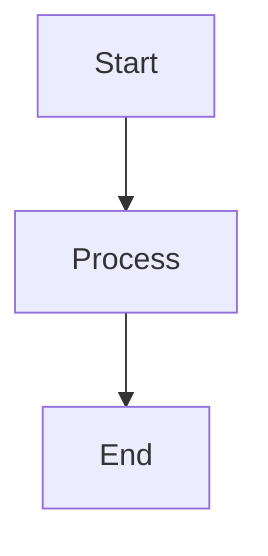
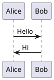

# Slidev FAQ (Frequently Asked Questions)

## Assets Handling

### Q: How do I reference images and other static assets?

**A**: There are multiple approaches:

#### 1. Relative Paths (Markdown)
For **statically analyzable URLs** in Markdown:

```md

```

This works in Markdown because Vite can analyze and process the path.

#### 2. Absolute Paths from Public Folder
For **frontmatter and components**, use absolute paths:

```md
---
background: /images/bg.png  # ✓ Correct
---

  <!-- ✓ Correct -->
```

**NOT**:
```md
---
background: ./images/bg.png  # ✗ Will cause 404 after build
---
```

#### 3. Import Assets in Components

```vue
<script setup>
import logo from './assets/logo.png'
</script>

<template>
  
</template>
```

### Why?

- **Relative paths** in Markdown are transformed by Vite
- **Frontmatter and dynamic bindings** aren't statically analyzed
- **Public folder assets** are served at root path
- **After build**, relative paths may break if not properly handled

## Positioning Elements

### Q: How do I position elements on slides?

**A**: CSS is the primary method. Slidev recommends these techniques:

#### 1. CSS Grid (Complex Layouts)

```vue
<div class="grid grid-cols-2 gap-4">
  <div>Left column</div>
  <div>Right column</div>
</div>
```

#### 2. Flexbox (Responsive Designs)

```vue
<div class="flex items-center justify-between">
  <div>Left</div>
  <div>Center</div>
  <div>Right</div>
</div>
```

#### 3. Absolute Positioning (UnoCSS)

```vue
<div class="absolute top-10 left-20">
  Positioned element
</div>
```

#### 4. Draggable Elements

Use `<VDrag>` component for interactive positioning:

```vue
<VDrag>
  <div>Draggable element</div>
</VDrag>
```

## Size Adjustment

### Q: How do I adjust the size of content?

**A**: Multiple options:

#### 1. Canvas Size (Global)

In frontmatter:

```md
---
canvasWidth: 980
---
```

#### 2. Per-Slide Zoom

```md
---
zoom: 1.5
---

# This slide is zoomed to 150%
```

#### 3. Transform Component

```vue
<Transform :scale="1.2">
  Scaled content
</Transform>
```

#### 4. CSS Classes

```vue
<div class="text-5xl">Large text</div>
<div class="w-full h-screen">Full size</div>
```

## Code Display

### Q: How do I display code with proper syntax highlighting?

**A**: Use code blocks with language specifier:

````md
```typescript
const greeting: string = 'Hello, World!'
console.log(greeting)
```
````

For advanced features:

````md
```ts {2-4}{maxHeight:'200px',lines:true}
// Line 1
// Lines 2-4 highlighted
// ...
// ...
```
````

## Fonts

### Q: How do I use custom fonts?

**A**: Two methods:

#### 1. Google Fonts (Automatic)

```md
---
fonts:
  sans: 'Roboto'
  serif: 'Roboto Slab'
  mono: 'Fira Code'
---
```

#### 2. Local Fonts

Place fonts in `public/fonts/`:

```css
/* styles/index.css */
@font-face {
  font-family: 'CustomFont';
  src: url('/fonts/custom.woff2');
}

body {
  font-family: 'CustomFont', sans-serif;
}
```

## Themes

### Q: How do I change or customize themes?

**A**:

#### Using a Theme

```md
---
theme: seriph
---
```

#### Installing Themes

```bash
npm install slidev-theme-example
```

```md
---
theme: example
---
```

#### Customizing Theme

Override in `styles/index.css`:

```css
:root {
  --slidev-theme-primary: #5b8c5a;
}
```

#### Creating Custom Theme

Eject existing theme:

```bash
slidev eject-theme
```

Or create from scratch - see Writing Themes guide.

## Animations

### Q: How do I animate elements?

**A**: Multiple approaches:

#### Click Animations

```vue
<v-click>Appears on click</v-click>
```

#### Motion Animations

```vue
<div
  v-motion
  :initial="{ x: -80 }"
  :enter="{ x: 0 }"
>
  Animated element
</div>
```

#### Slide Transitions

```md
---
transition: slide-left
---
```

## Presenter Mode

### Q: How do I use presenter mode?

**A**:

1. Press `p` or click presenter button
2. Open two windows:
   - Audience: `http://localhost:3030/`
   - Presenter: `http://localhost:3030/presenter`
3. Present from presenter window
4. Show audience window to audience

## Export

### Q: How do I export to PDF?

**A**:

```bash
# Install playwright
npm install -D playwright-chromium

# Export
slidev export
```

For PPTX:
```bash
slidev export --format pptx
```

## Performance

### Q: My slides are slow. How do I improve performance?

**A**:

1. **Optimize images**: Compress and resize
2. **Lazy load heavy components**: Use dynamic imports
3. **Limit animations**: Don't overuse
4. **Pre-bundle dependencies**: Configure in vite.config.ts
5. **Use production build**: `slidev build`

## Mobile

### Q: Do slides work on mobile?

**A**: Yes! Slidev is responsive:

- Touch gestures supported
- Swipe to navigate
- Responsive layouts
- May need adjustments for optimal mobile experience

## Deployment

### Q: How do I deploy my slides?

**A**:

```bash
# Build
slidev build --base /my-slides/

# Deploy to various platforms
# See hosting guide for specific platform instructions
```

Popular platforms:
- GitHub Pages
- Netlify
- Vercel
- Any static hosting

## Recording

### Q: Can I record my presentation?

**A**: Yes!

1. Click recording button in UI
2. Or press `r`
3. Grant camera/microphone permissions
4. Present and record
5. Download video when done

Uses WebRTC (RecordRTC) - all client-side, no server upload.

## Dark Mode

### Q: How do I enable dark mode?

**A**:

#### Toggle During Presentation
Press `d` key

#### Set Default

```md
---
colorSchema: 'dark'
---
```

#### Auto (System Preference)

```md
---
colorSchema: 'auto'
---
```

## LaTeX/Math

### Q: How do I add mathematical equations?

**A**:

#### Inline Math

```md
Pythagorean theorem: $a^2 + b^2 = c^2$
```

#### Block Math

```md
$$
\int_0^\infty e^{-x^2} dx = \frac{\sqrt{\pi}}{2}
$$
```

## Diagrams

### Q: How do I add diagrams?

**A**: Slidev supports:

#### Mermaid

````md

````

#### PlantUML

````md

````

## Components

### Q: Can I use Vue components?

**A**: Absolutely!

Create in `components/` directory:

```vue
<!-- components/Counter.vue -->
<script setup>
import { ref } from 'vue'
const count = ref(0)
</script>

<template>
  <button @click="count++">Count: {{ count }}</button>
</template>
```

Use in slides:
```md
<Counter />
```

## Keyboard Shortcuts

### Q: What are the keyboard shortcuts?

**A**: Press `?` during presentation to see all shortcuts.

Common ones:
- `Space` / `→`: Next
- `←`: Previous
- `f`: Fullscreen
- `o`: Overview
- `d`: Dark mode
- `p`: Presenter mode

## Drawing

### Q: Can I draw on slides during presentation?

**A**: Yes!

1. Press `c` or click drawing button
2. Draw with mouse/touch
3. Press `c` again to exit

Tools include:
- Freehand
- Arrows
- Shapes
- Colors

## Background

### Q: How do I set slide backgrounds?

**A**:

#### Image Background

```md
---
background: /images/bg.png
---
```

#### Color Background

```md
---
background: '#5b8c5a'
---
```

#### Gradient Background

```md
---
background: linear-gradient(45deg, #5b8c5a, #2d5a2d)
---
```

## Icons

### Q: How do I use icons?

**A**: Slidev includes Iconify:

```vue
<carbon-logo-github />
<mdi-home />
<heroicons-outline-user />
```

Browse icons at: https://icones.js.org/

## TypeScript

### Q: Can I use TypeScript?

**A**: Yes! TypeScript is supported out of the box:

- `.ts` files in setup/
- `<script setup lang="ts">` in components
- Type checking in Monaco editor

## Offline

### Q: Can I present offline?

**A**: Yes!

1. Build: `slidev build`
2. Serve built files: `npx vite preview`
3. Or deploy to static hosting

Built slides work completely offline.

## Tips & Tricks

### Presenter Notes

```md
# Slide

Content

<!--
These are presenter notes.
Only visible in presenter mode.
-->
```

### Hide Slides

```md
---
hide: true
---

# This slide is hidden
```

### Disable Slides

```md
---
disabled: true
---

# This slide is disabled
```

### Custom Click Count

```md
---
clicks: 5
---

# Slide with custom clicks
```

## Troubleshooting

### Port Already in Use

```bash
slidev --port 3031
```

### Cache Issues

```bash
rm -rf node_modules/.vite
npm run dev
```

### Build Fails

1. Check Node version (>=18.0)
2. Clear cache
3. Reinstall dependencies
4. Check vite.config.ts

## Reference
- Official FAQ: https://sli.dev/guide/faq
